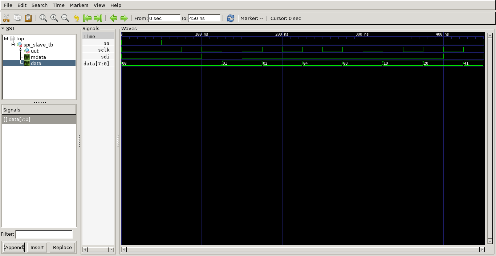

# DIGITALLY PROGRAMMABLE GAIN AMPLIFIER

## 1. LIST OF THE INVOLVED TEAM MEMBERS

- Francisco de Assis Brito Filho (Faculty member)
- Hugo Dias Giló (Undergraduate student)
- Daniel Da Silva Santos (Undergraduate student)

## 2. A SHORT DESCRIPTION OF THE CIRCUIT

The proposed circuit is a Digitally Programmable Gain Amplifier (DVGA) which will work to amplify voltage signal with programmable gain options, ranging from 1 V / V to 256 V / V. The main core is an OTA Miller with output buffer configured as an inverter amplifier. The circuit feedback resistances is controlled by 8 CMOS switches (Transmission Gates) that are configured according to binary word stored in the shift register which is connected to a Serial Peripheral Interface (SPI) that provides a connection for external control.

## 3. PERFORMANCE SUMMARY TABLE

| Parameter               |  Specification      | Unit                |
| ----------------------- | ------------------- | ------------------- |
| Vdd                     | 1.8                 | V                   |
| Output Swing            | (1.8 -0.64)         | V                   |
| Open-loop Gain          | 42.3                | dB                  |
| Programmable gain range | 4.6-250             | V/V                 |
| GBW                     | 2.8                 | MHz                 |
| Phase margin            | 47                  | °                   |
| Slew Rate               | 0.7                 | V/us                |
| CMRR                    | 88                  | dB                  |
| Area                    | 0.03                | mm²                 |

**Table 1** – DPGA performance.

## 4. A BLOCK DIAGRAM

**Figure 1** – DPGA Block Diagram.

The circuit is composed by an operational amplifier with adjusted gain programmable using CMOS switches. The programmable interface is a serial input as an SPI in order to provide access to external devices to control the gain.

## 5. SCHEMATICS OF THE CRITICAL CIRCUIT CORE

Below are the schematics of the critical circuit core, an Operational Amplifier using the OTA Miller with output buffer.

**Figure 2** - OpAmp with digitally programmable schematic.

The negative feedback loop of the Operational Amplifier has resistances controlled by CMOS switches in order to program the overall gain, as in figure 3.

**Figure 3** - OpAmp with digitally programmable schematic.

## 6. CREATED SCHEMATICS
Below are the schematics created in the XSCHEM software.

**Figure 4** - Digital potentiometer.

**Figure 5** - Digital potentiometer and OTA.

**Figure 6** - DPGA top entity with load.

**Figure 7** - OTA Miller schematic.

**Figure 8** - Transmission gate with control.

## 7. Layouts

The analog and digital circuit layouts created will be presented below. 

**Figure 9** - Digital potentiometer layout.

**Figure 10** - DPGA layout.

**Figure 11** - OTA Miller layout.

**Figure 12** - SPI module layout.

**Figure 13** - SPI module layout with ports highlights.

## 8. Simulations
The results of the simulations carried out will be presented below.

**Figure 14** - DPGA minimum gain.

**Figure 15** - DPGA maximum gain.

**Figure 16** - Digital potentiometer simulation.

**Figure 17** - OTA CMRR simultation.

**Figure 18** - OTA gain.

**Figure 19** - OTA DC simulation.

**Figure 20** - OTA large signal simulation.

**Figure 21** - OTA transient simulation.

**Figure 22** - SPI simulation.

## 8. PORTS

| Port                    | type                |
| ----------------------- | ------------------- |
| ss                      | digital input       |
| sclk                    | digital input       |
| sdi                     | digital input       |
| reset'                  | digital input       |
| in                      | analog input        |
| in2                     | analog input        |
| Ib                      | analog input        |
| out                     | analog output       |
| vd1                     | power               |
| gnd1                    | power               |
| vd2                     | power               |
| vs                      | power               |
| gnd2                    | power               |

## 9. APPLICABLE REFERENCES

Main references for OpAmp Design are:

- P. E. Allen, D. R. Holberg. CMOS Analog Circuit Design. 2nd Ed., Oxford, New York, 2002.
- B. Razavi. Design of Analog CMOS Integrated Circuits. McGraw -Hill, New York, 2001.
- P. Jespers, B. Murmann. Systematic Design of Analog CMOS Circuits: Using Pre-Computed Lookup. Cambridge Press. 2017.
